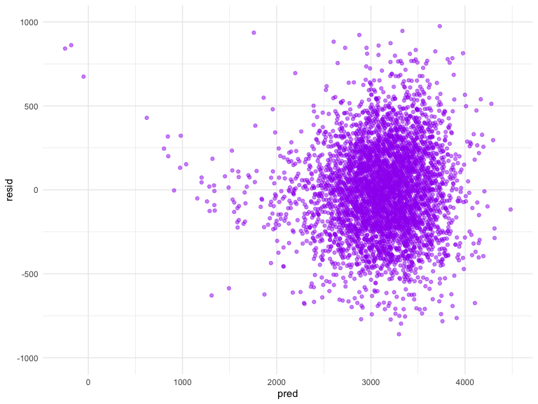

p8105\_hw6\_ob2305
================
Olya Besedina

# Problem 1

## Fit regression model

``` r
my_model  = lm(bwt ~ babysex + bhead + blength + delwt + fincome + gaweeks + mheight + momage + mrace + parity + ppbmi + smoken, data = birthweight_1)

summary(my_model)
```

    ## 
    ## Call:
    ## lm(formula = bwt ~ babysex + bhead + blength + delwt + fincome + 
    ##     gaweeks + mheight + momage + mrace + parity + ppbmi + smoken, 
    ##     data = birthweight_1)
    ## 
    ## Residuals:
    ##      Min       1Q   Median       3Q      Max 
    ## -1068.40  -184.61    -3.67   173.04  2438.23 
    ## 
    ## Coefficients:
    ##               Estimate Std. Error t value Pr(>|t|)    
    ## (Intercept) -5593.6768   176.6878 -31.659  < 2e-16 ***
    ## babysex        32.2681     8.5472   3.775 0.000162 ***
    ## bhead         134.4763     3.4681  38.775  < 2e-16 ***
    ## blength        76.4635     2.0375  37.527  < 2e-16 ***
    ## delwt           3.9196     0.3938   9.953  < 2e-16 ***
    ## fincome         0.6787     0.1770   3.835 0.000127 ***
    ## gaweeks        12.0448     1.4808   8.134 5.37e-16 ***
    ## mheight        -5.7180     2.2771  -2.511 0.012071 *  
    ## momage          3.0832     1.1694   2.637 0.008405 ** 
    ## mrace         -54.2415     6.0088  -9.027  < 2e-16 ***
    ## parity         89.1435    40.9246   2.178 0.029442 *  
    ## ppbmi         -15.7918     2.4864  -6.351 2.36e-10 ***
    ## smoken         -3.7315     0.5815  -6.417 1.54e-10 ***
    ## ---
    ## Signif. codes:  0 '***' 0.001 '**' 0.01 '*' 0.05 '.' 0.1 ' ' 1
    ## 
    ## Residual standard error: 275.5 on 4329 degrees of freedom
    ## Multiple R-squared:  0.7114, Adjusted R-squared:  0.7106 
    ## F-statistic: 889.1 on 12 and 4329 DF,  p-value: < 2.2e-16

``` r
my_model %>% 
  broom::glance()
```

    ## # A tibble: 1 x 11
    ##   r.squared adj.r.squared sigma statistic p.value    df  logLik    AIC
    ##       <dbl>         <dbl> <dbl>     <dbl>   <dbl> <int>   <dbl>  <dbl>
    ## 1     0.711         0.711  276.      889.       0    13 -30551. 61130.
    ## # … with 3 more variables: BIC <dbl>, deviance <dbl>, df.residual <int>

``` r
# adj R^2 0.7106
# AIC 61130
```

Residuals and fitted values

``` r
# add residuals
birthweight = modelr::add_residuals(birthweight, my_model) 
# add predictions
birthweight = modelr::add_predictions(birthweight, my_model)

birthweight%>%
  ggplot(aes(x = pred, y = resid))+
  geom_point(color = "purple", alpha = .5)+
   ylim(-1000, 1000)
```



The plot of residuals against fitted values shows distribution of data
points around 0.

## Compare to two other model:

``` r
model_1 = lm(bwt ~ blength + gaweeks, data = birthweight)
summary(model_1)
```

    ## 
    ## Call:
    ## lm(formula = bwt ~ blength + gaweeks, data = birthweight)
    ## 
    ## Residuals:
    ##     Min      1Q  Median      3Q     Max 
    ## -1709.6  -215.4   -11.4   208.2  4188.8 
    ## 
    ## Coefficients:
    ##              Estimate Std. Error t value Pr(>|t|)    
    ## (Intercept) -4347.667     97.958  -44.38   <2e-16 ***
    ## blength       128.556      1.990   64.60   <2e-16 ***
    ## gaweeks        27.047      1.718   15.74   <2e-16 ***
    ## ---
    ## Signif. codes:  0 '***' 0.001 '**' 0.01 '*' 0.05 '.' 0.1 ' ' 1
    ## 
    ## Residual standard error: 333.2 on 4339 degrees of freedom
    ## Multiple R-squared:  0.5769, Adjusted R-squared:  0.5767 
    ## F-statistic:  2958 on 2 and 4339 DF,  p-value: < 2.2e-16

``` r
model_1 %>% 
  broom::glance()
```

    ## # A tibble: 1 x 11
    ##   r.squared adj.r.squared sigma statistic p.value    df  logLik    AIC
    ##       <dbl>         <dbl> <dbl>     <dbl>   <dbl> <int>   <dbl>  <dbl>
    ## 1     0.577         0.577  333.     2958.       0     3 -31381. 62771.
    ## # … with 3 more variables: BIC <dbl>, deviance <dbl>, df.residual <int>

``` r
# adj R^2 0.5767
# AIC 62771


model_2 = lm(bwt ~ babysex*blength*bhead, data = birthweight)
summary(model_2)
```

    ## 
    ## Call:
    ## lm(formula = bwt ~ babysex * blength * bhead, data = birthweight)
    ## 
    ## Residuals:
    ##      Min       1Q   Median       3Q      Max 
    ## -1132.99  -190.42   -10.33   178.63  2617.96 
    ## 
    ## Coefficients:
    ##                         Estimate Std. Error t value Pr(>|t|)    
    ## (Intercept)           -13551.685   2759.413  -4.911 9.39e-07 ***
    ## babysex                 6374.868   1677.767   3.800 0.000147 ***
    ## blength                  225.900     57.398   3.936 8.43e-05 ***
    ## bhead                    380.189     83.395   4.559 5.28e-06 ***
    ## babysex:blength         -123.773     35.119  -3.524 0.000429 ***
    ## babysex:bhead           -198.393     51.092  -3.883 0.000105 ***
    ## blength:bhead             -4.432      1.715  -2.583 0.009815 ** 
    ## babysex:blength:bhead      3.878      1.057   3.670 0.000245 ***
    ## ---
    ## Signif. codes:  0 '***' 0.001 '**' 0.01 '*' 0.05 '.' 0.1 ' ' 1
    ## 
    ## Residual standard error: 287.7 on 4334 degrees of freedom
    ## Multiple R-squared:  0.6849, Adjusted R-squared:  0.6844 
    ## F-statistic:  1346 on 7 and 4334 DF,  p-value: < 2.2e-16

``` r
model_2 %>% 
  broom::glance()
```

    ## # A tibble: 1 x 11
    ##   r.squared adj.r.squared sigma statistic p.value    df  logLik    AIC
    ##       <dbl>         <dbl> <dbl>     <dbl>   <dbl> <int>   <dbl>  <dbl>
    ## 1     0.685         0.684  288.     1346.       0     8 -30742. 61501.
    ## # … with 3 more variables: BIC <dbl>, deviance <dbl>, df.residual <int>

``` r
# adj R^2 0.6844
# AIC 61501
```

## Cross validation
