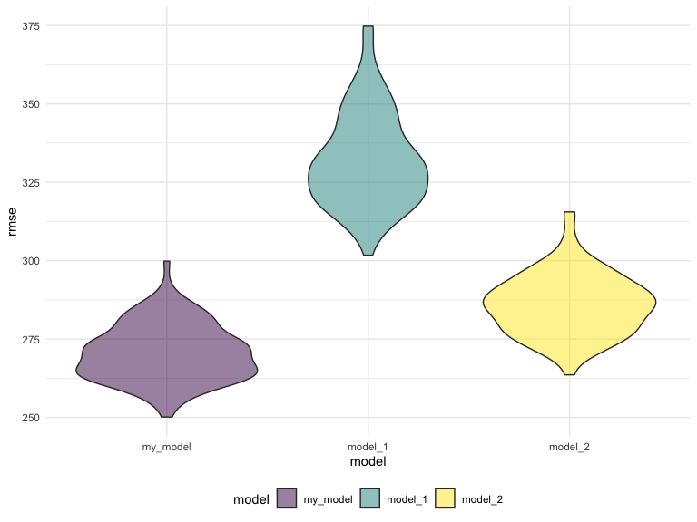

p8105\_hw6\_ob2305
================
Olya Besedina

# Problem 1

Birth weight dataset contains 4342 observations, 22 variables and no
missing values. Four variables were recoded as factors, those variables
are `babysex, frace, malform and mrace`.

``` r
birthweight = read.csv(file = "./data/birthweight.csv") %>% 
   janitor::clean_names() %>% 
   mutate(
      babysex = as.factor(babysex),
      frace = as.factor(frace),
      malform = as.factor(malform),
      mrace = as.factor(mrace))

# check for missing data
skimr::skim(birthweight)
```

    ## Skim summary statistics
    ##  n obs: 4342 
    ##  n variables: 20 
    ## 
    ## ── Variable type:factor ─────────────────────────────────────────────────────────────────────
    ##  variable missing complete    n n_unique                      top_counts
    ##   babysex       0     4342 4342        2         1: 2230, 2: 2112, NA: 0
    ##     frace       0     4342 4342        5 1: 2123, 2: 1911, 4: 248, 3: 46
    ##   malform       0     4342 4342        2           0: 4327, 1: 15, NA: 0
    ##     mrace       0     4342 4342        4 1: 2147, 2: 1909, 4: 243, 3: 43
    ##  ordered
    ##    FALSE
    ##    FALSE
    ##    FALSE
    ##    FALSE
    ## 
    ## ── Variable type:integer ────────────────────────────────────────────────────────────────────
    ##  variable missing complete    n      mean     sd  p0  p25    p50  p75 p100
    ##     bhead       0     4342 4342   33.65     1.62  21   33   34     35   41
    ##   blength       0     4342 4342   49.75     2.72  20   48   50     51   63
    ##       bwt       0     4342 4342 3114.4    512.15 595 2807 3132.5 3459 4791
    ##     delwt       0     4342 4342  145.57    22.21  86  131  143    157  334
    ##   fincome       0     4342 4342   44.11    25.98   0   25   35     65   96
    ##  menarche       0     4342 4342   12.51     1.48   0   12   12     13   19
    ##   mheight       0     4342 4342   63.49     2.66  48   62   63     65   77
    ##    momage       0     4342 4342   20.3      3.88  12   18   20     22   44
    ##    parity       0     4342 4342    0.0023   0.1    0    0    0      0    6
    ##   pnumlbw       0     4342 4342    0        0      0    0    0      0    0
    ##   pnumsga       0     4342 4342    0        0      0    0    0      0    0
    ##      ppwt       0     4342 4342  123.49    20.16  70  110  120    134  287
    ##    wtgain       0     4342 4342   22.08    10.94 -46   15   22     28   89
    ##      hist
    ##  ▁▁▁▁▅▇▁▁
    ##  ▁▁▁▁▁▇▁▁
    ##  ▁▁▁▃▇▇▂▁
    ##  ▁▇▅▁▁▁▁▁
    ##  ▁▂▇▂▂▂▁▃
    ##  ▁▁▁▁▂▇▁▁
    ##  ▁▁▁▅▇▂▁▁
    ##  ▂▇▅▂▁▁▁▁
    ##  ▇▁▁▁▁▁▁▁
    ##  ▁▁▁▇▁▁▁▁
    ##  ▁▁▁▇▁▁▁▁
    ##  ▁▇▆▁▁▁▁▁
    ##  ▁▁▁▇▇▁▁▁
    ## 
    ## ── Variable type:numeric ────────────────────────────────────────────────────────────────────
    ##  variable missing complete    n  mean   sd    p0   p25   p50   p75 p100
    ##   gaweeks       0     4342 4342 39.43 3.15 17.7  38.3  39.9  41.1  51.3
    ##     ppbmi       0     4342 4342 21.57 3.18 13.07 19.53 21.03 22.91 46.1
    ##    smoken       0     4342 4342  4.15 7.41  0     0     0     5    60  
    ##      hist
    ##  ▁▁▁▁▃▇▁▁
    ##  ▁▇▅▁▁▁▁▁
    ##  ▇▁▁▁▁▁▁▁

## Fit regression model

Regression model was first fit for the outcome of interest - baby
birthweight in grams - with all the variables in the `birthweight`
dataset. Non-significant predictors were removed one-by-ne and model was
refitted; this process was repeated untill only significant predictors
were left in the model. Those predictors are: `babysex, bhead, blength,
delwt, fincome, gaweeks, mheight, momage, mrace, parity, ppbmi,
smoken`.

``` r
my_model  = lm(bwt ~ babysex + bhead + blength + delwt + fincome + gaweeks + mheight + momage + mrace + parity + ppbmi + smoken, data = birthweight)

adj_r_sq_mm = my_model %>% 
   broom::glance() %>% 
   pull(adj.r.squared)

aic_mm = 
   my_model %>% 
   broom::glance() %>% 
   pull(AIC)
```

Model diagnostics were performed using `broom::glance`. Adjusted
r-squared for the obtained model is 0.7170828 and AIC is 6.103304610^{4}

Varience is depicted by residuals and fitted values, which are
distributed around 0 and show somewhat constant varience. Residuals were
cut off at 1000 to exclude extreme outliers.

``` r
# add residuals
birthweight = modelr::add_residuals(birthweight, my_model) 
# add predictions
birthweight = modelr::add_predictions(birthweight, my_model)

birthweight%>%
  ggplot(aes(x = pred, y = resid))+
  geom_point(color = "purple", alpha = .5)+
   # cut off at 1000 to exclude extreme outliers
   ylim(-1000, 1000)
```


## Compare to two other model

``` r
model_1 = lm(bwt ~ blength + gaweeks, data = birthweight)

model_1 %>% 
  broom::glance()
```

    ## # A tibble: 1 x 11
    ##   r.squared adj.r.squared sigma statistic p.value    df  logLik    AIC
    ##       <dbl>         <dbl> <dbl>     <dbl>   <dbl> <int>   <dbl>  <dbl>
    ## 1     0.577         0.577  333.     2958.       0     3 -31381. 62771.
    ## # … with 3 more variables: BIC <dbl>, deviance <dbl>, df.residual <int>

``` r
model_2 = lm(bwt ~ babysex*blength*bhead, data = birthweight)
summary(model_2)
```

    ## 
    ## Call:
    ## lm(formula = bwt ~ babysex * blength * bhead, data = birthweight)
    ## 
    ## Residuals:
    ##      Min       1Q   Median       3Q      Max 
    ## -1132.99  -190.42   -10.33   178.63  2617.96 
    ## 
    ## Coefficients:
    ##                          Estimate Std. Error t value Pr(>|t|)    
    ## (Intercept)            -7176.8170  1264.8397  -5.674 1.49e-08 ***
    ## babysex2                6374.8684  1677.7669   3.800 0.000147 ***
    ## blength                  102.1269    26.2118   3.896 9.92e-05 ***
    ## bhead                    181.7956    38.0542   4.777 1.84e-06 ***
    ## babysex2:blength        -123.7729    35.1185  -3.524 0.000429 ***
    ## babysex2:bhead          -198.3932    51.0917  -3.883 0.000105 ***
    ## blength:bhead             -0.5536     0.7802  -0.710 0.478012    
    ## babysex2:blength:bhead     3.8781     1.0566   3.670 0.000245 ***
    ## ---
    ## Signif. codes:  0 '***' 0.001 '**' 0.01 '*' 0.05 '.' 0.1 ' ' 1
    ## 
    ## Residual standard error: 287.7 on 4334 degrees of freedom
    ## Multiple R-squared:  0.6849, Adjusted R-squared:  0.6844 
    ## F-statistic:  1346 on 7 and 4334 DF,  p-value: < 2.2e-16

``` r
model_2 %>% 
  broom::glance()
```

    ## # A tibble: 1 x 11
    ##   r.squared adj.r.squared sigma statistic p.value    df  logLik    AIC
    ##       <dbl>         <dbl> <dbl>     <dbl>   <dbl> <int>   <dbl>  <dbl>
    ## 1     0.685         0.684  288.     1346.       0     8 -30742. 61501.
    ## # … with 3 more variables: BIC <dbl>, deviance <dbl>, df.residual <int>

## Cross validation

Cross validation of birth weight dataset was performed 100 times using
`modelr::crossv_mc`. Linear regression was fit for each sample and rmse
were compared visually in violin plot.

``` r
cv_df = 
  crossv_mc(birthweight, 100)

# convert every list to dataframe
cv_df =
  cv_df %>% 
  mutate(
    train = map(train, as_tibble),
    test = map(test, as_tibble))

cv_results = 
   cv_df %>% 
   mutate(
      my_model = map(train, ~my_model),
      model_1 = map(train, ~ model_1),
      model_2 = map(train, ~ model_2),
      
      rmse_my_model = map2_dbl(my_model, test, ~rmse(model = .x, data = .y)),
      rmse_model_1 = map2_dbl(model_1, test, ~rmse(model = .x, data = .y)),
      rmse_model_2 = map2_dbl(model_2, test, ~rmse(model = .x, data = .y)))
```

A violin plot depicts distribution of rmse for each model from 100
training - testing splits. Based on the plot `my_model` is the best
model among the 3 models depicted, because it has the lowest rmse
values.

``` r
cv_results %>% 
  select(starts_with("rmse")) %>% 
  pivot_longer(
    everything(),
    names_to = "model", 
    values_to = "rmse",
    names_prefix = "rmse_") %>% 
  mutate(model = fct_inorder(model)) %>% 
  ggplot(aes(x = model, y = rmse, fill = model)) + 
  geom_violin(alpha = .5)
```



# Problem 2

``` r
weather_df = 
  rnoaa::meteo_pull_monitors(
    c("USW00094728"),
    var = c("PRCP", "TMIN", "TMAX"), 
    date_min = "2017-01-01",
    date_max = "2017-12-31") %>%
  mutate(
    name = recode(id, USW00094728 = "CentralPark_NY"),
    tmin = tmin / 10,
    tmax = tmax / 10) %>%
  select(name, id, everything())
```

    ## Registered S3 method overwritten by 'crul':
    ##   method                 from
    ##   as.character.form_file httr

    ## Registered S3 method overwritten by 'hoardr':
    ##   method           from
    ##   print.cache_info httr

    ## file path:          /Users/Olya/Library/Caches/rnoaa/ghcnd/USW00094728.dly

    ## file last updated:  2019-09-26 10:27:28

    ## file min/max dates: 1869-01-01 / 2019-09-30

Weather dataset was obtained from NOAA via rnoaa pachage. It contains
365 observations and 6 variables name, id, date, prcp, tmax, tmin.

Bootstraping `weather_df` 5000 times using `modelr` package.

``` r
#dataset for log(b0*b1)
bootstrap_beta = 
   weather_df %>% 
   modelr::bootstrap(n = 5000) %>%
   mutate(
      models = map(strap, ~lm(tmax ~ tmin, data = .)),
      # obtain beta0 and beta1 using broom::tidy
      results = map(models, broom::tidy)
   ) %>% 
   unnest(results) %>% 
   select(.id:estimate, -models) %>% 
   pivot_wider(
      names_from = "term",
      values_from = "estimate") %>% 
   rename(intercept = '(Intercept)') %>% 
   mutate(
      log_b0_b1 = log(intercept*tmin)
   ) %>% 
   select(.id, log_b0_b1)

#dataset for r^2
bootstrap_r2 = 
   weather_df %>% 
   modelr::bootstrap(n = 5000) %>%
   mutate(
      models = map(strap, ~lm(tmax ~ tmin, data = .)),
      # obtain r^2 values using broom::glance
      results = map(models, broom::glance)
   ) %>% 
   unnest(results) %>% 
   select(.id, r.squared)

# join two datasets
bootstrap_data = 
   inner_join(bootstrap_beta, bootstrap_r2, by = ".id") %>% 
   janitor::clean_names()
```

The plot below depicts distribution for the estimates obtained from
bootstraping.

  - Distribution of R-squared does ~N distribution, but is slightly
    right skewed. The average R-squared value for the 5000 fitted linear
    regression is about 47%, meaning that about 47% values of `tmax` is
    explained by the value of `tmin`.
  - Distribution of log(beta0\*beta1) ~N distribution with the average
    value of 16.

<!-- end list -->

``` r
# density plot of r^2
rsq = 
   bootstrap_data%>%
   ggplot(aes(x = r_squared))+
   geom_density(fill = "yellow", alpha = .7)+
   labs(
      title = "Distribution of R^2",
      x = "R^2",
      y = "Density",
      caption = "Data from NOAA via rnoaa pachage"
   )

# density plot of log(b0*b1)
log_b0_b1 = 
   bootstrap_data%>%
   ggplot(aes(x = log_b0_b1))+
   geom_density(fill = "pink", alpha = .7)+
   labs(
      title = "Distribution of log(beta0 * beta1)",
      x = "log(beta0 * beta1)",
      y = "Density",
      caption = "Data from NOAA via rnoaa pachage")

rsq + log_b0_b1
```


The 95% Confidence Interval for R-squared estimates is between 0.8945305
and 0.927295.

The 95% Confidence Interval for log(beta0 \* beta1) is between 1.9663656
and 2.0583795
